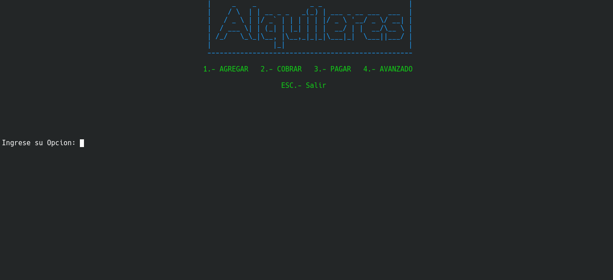
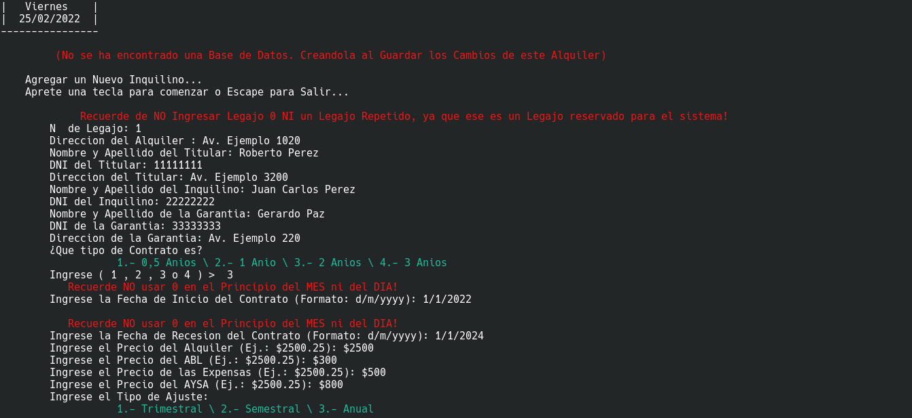
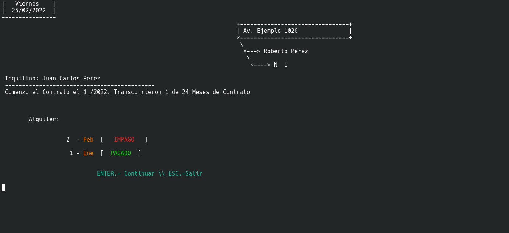
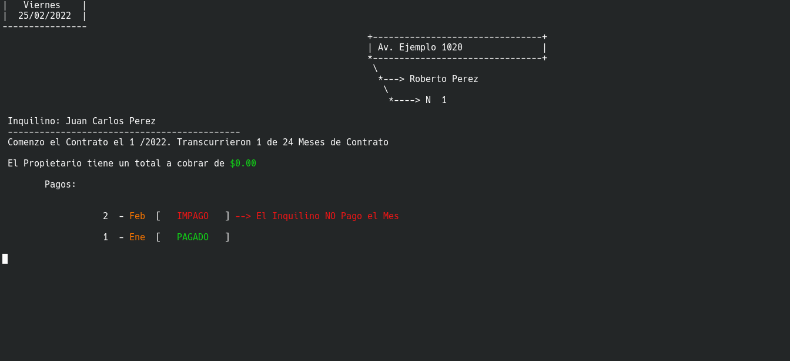
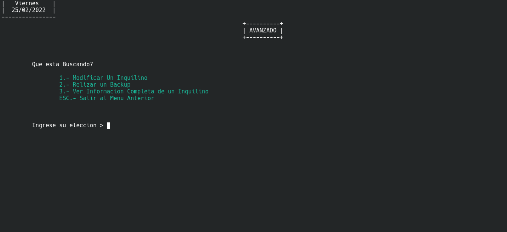

# InmobiAdmin
## ¿Que es?
InmobiAdmin es un software de Administración para Inmobiliarias Argentinas que administra los Cobros de los Inquilinos y Pagos de los Propietarios de las propiedades, calculando los Intereses, Pagos, Descuentos, etc.

## Requisitos
Para poder ejecutar este programa correctamente debe de estar usando **GNU/Linux** o Windows.

## Ejecución
Para poder ejecutarlo puede:

- Compilar el programa (Dentro de la Carpeta con el Codigo Fuente) ejecutando `gcc InmobiAdmin.c -o InmobiAdmin`.

- Descargar el [El Comprimido con el Binario](<!-- HACER -->) para GNU/Linux x86_64 (El binario se llama "InmobiAdmin_Linux_X86-64") y Ejecutarlo.

## Eso es Todo!
Mucha gracias por interesarse en este programa. Este programa está licenciado bajo GNU GPL V3.
